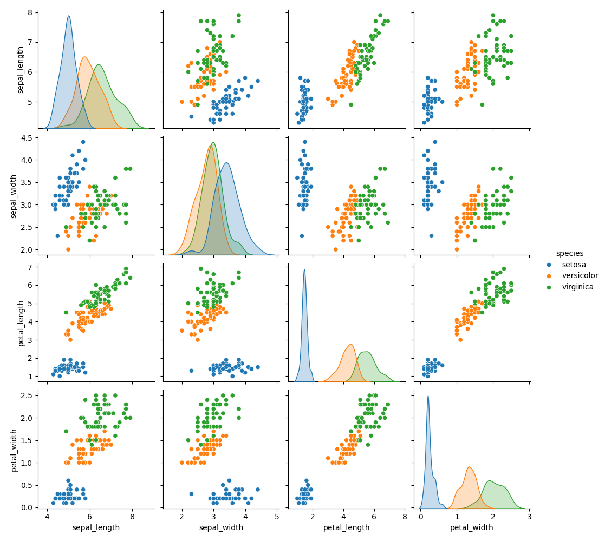

# Iris-Classification

## Problem Statement
- This is a dataset that contains 150 rows of data about different species of Iris flowers. There is an equal number of rows for each species. 

- The purpose of this analysis is to create a model to accurately predict the species based on the petals and sepals. 

## Data Dictionary

| Column Name | Description |
|-------------|-------------|
| **sepal_length** | Length of the sepal of the flower (cm).                          |
| **sepal_width**  | Width of the sepal of the flower (cm).                           |
| **petal_length** | Length of the petal of the flower (cm).                          |
| **petal_width**  | Width of the petal of the flower (cm).                           |
| **species**      | Species of the iris flower (setosa, versicolor, virginica). |

## Executive Summary

### Data Cleaning Steps
No data cleaning had to be performed on this dataset. 

### Key Visualizations
Include key visualizations that highlight important aspects of the data. Use graphs, charts, or any other visual representation to make your points.

#### Visualization 1: [Pairplot of the Columns]
This shows all the scatterplots of the different features for the petals and sepals. It also shows histograms of each feature. 

#### Visualization 1: [Title]
[Description and interpretation of the first visualization.]

#### Visualization 2: [Title]
[Description and interpretation of the second visualization.]

## Conclusions/Recommendations
Summarize the main findings from your analysis. If applicable, provide recommendations based on the insights gained from the data.

## Additional Information
Include any additional information, references, or resources that might be relevant for understanding the analysis.

---

Feel free to replace the placeholders with your actual content. Additionally, if you have images for your visualizations, make sure to replace the placeholder paths with the correct file paths or URLs.

Once you've filled in the content, save the file with a `.md` extension (e.g., `README.md`). You can use this Markdown file on platforms like GitHub to provide a well-structured README for your analysis.
